# 예비창업패키지 예비창업자 사업계획서

---

## 일반현황

| 항목 | 내용 |
|------|------|
| **창업아이템명** | GPT-4 기반 개인 맞춤형 AI 학습 플랫폼 LearnAI |
| **산출물 (협약기간 내 목표)** | 모바일 어플리케이션(1개), 웹사이트(1개), AI 학습 엔진 MVP(1개) |
| **직업** | 연구원 / 스타트업 경영 |
| **기업(예정)명** | 주식회사 런에이아이 (LearnAI Inc.) |

### 팀 구성 현황 (대표자 본인 제외)

| 순번 | 직위 | 담당 업무 | 보유 역량 (경력 및 학력 등) | 구성 상태 |
|------|------|----------|--------------------------|----------|
| 1 | CTO | AI 엔진 개발 총괄 | 전산학 박사, ML엔지니어 경력(8년) | 완료 |
| 2 | CPO | 제품 기획/UX | 인지과학 석사, Product Designer 경력(7년) | 완료 |
| 3 | CMO | 마케팅 전략 | 경영학 학사, 에듀테크 마케팅 경력(8년) | 완료 |
| 4 | 백엔드 개발자 | 서버 개발 | 컴퓨터공학 학사, 개발 경력(3년 이상) | 예정('25.3) |
| 5 | 프론트엔드 개발자 | 앱/웹 개발 | 소프트웨어공학 학사, 개발 경력(2년 이상) | 예정('25.4) |

---

## 창업 아이템 개요(요약)

| 항목 | 내용 |
|------|------|
| **명칭** | LearnAI (런에이아이) |
| **범주** | AI 기반 적응형 학습 플랫폼 |

### 창업 아이템 개요

LearnAI는 GPT-4 기반 대화형 AI 튜터와 강화학습 적응형 알고리즘을 결합한 개인 맞춤형 K-12 학습 플랫폼입니다. 학생 개개인의 문제 풀이 패턴, 오답 유형, 학습 시간대, 집중도 등을 실시간으로 분석하여 최적화된 학습 경로와 콘텐츠를 자동 생성합니다. 기존 온라인 교육이 모든 학생에게 동일한 콘텐츠를 제공하는 것과 달리, LearnAI는 진정한 개인화 학습을 실현하며, 24시간 AI 튜터 질의응답, 학부모 대시보드를 통한 학습 현황 공유 기능을 제공합니다.

### 문제 인식 (Problem)

2024년 국내 사교육비가 29.2조원을 돌파하고 참여율이 80%에 달하는 상황에서, 학부모들은 높은 비용에도 불구하고 획일화된 교육으로 인한 학습 효율 저하 문제를 겪고 있습니다. 정부의 AI 디지털교과서(AIDT) 정책 혼란으로 학교 현장에서의 AI 교육 도입이 지연되면서, 민간 AI 학습 플랫폼에 대한 수요가 급증하고 있습니다. 기존 경쟁사들은 특정 과목(영어/수학)에 특화되어 있어 전 과목 통합 AI 학습 솔루션의 시장 공백이 존재합니다.

### 실현 가능성 (Solution)

협약기간 8개월 내에 중등 수학/영어 과목 MVP를 개발하여 출시합니다. GPT-4 API를 활용한 AI 튜터 엔진, DKT(Deep Knowledge Tracing) 기반 학습 진단 시스템, 강화학습 기반 적응형 커리큘럼 생성 알고리즘을 핵심 기술로 구현합니다. 차별화 포인트는 단순 문제 추천이 아닌 대화형 소크라틱 학습 방식과 풀이 과정 분석을 통한 정밀 진단입니다.

### 성장전략 (Scale-up)

1단계로 중등 수학/영어 시장에 집중하여 초기 사용자 5만명을 확보하고, 2단계에서 초등/고등으로 학년 확장, 3단계에서 B2B 학원/학교 파트너십을 통해 시장 점유율을 확대합니다. B2C 구독 모델(월 19,900원~59,900원)과 B2B 기관 라이선스 모델을 통해 수익을 창출하며, 5년 내 MAU 100만명, 매출 1,000억원을 목표로 합니다.

### 팀 구성 (Team)

대표자는 AI 연구원 및 에듀테크 스타트업 COO 경력을 보유하고 있으며, MBA 과정을 통해 경영 역량을 갖추었습니다. CTO는 글로벌 빅테크 기업 ML엔지니어 출신으로 AI 엔진 개발을 총괄하며, CPO는 핀테크 및 에듀테크 PM 경력을 바탕으로 사용자 중심 제품 설계를 담당합니다. CMO는 대형 교육기업 마케팅 경력을 보유하여 학부모 타겟 마케팅 전략을 수립합니다. OpenAI API 파트너십, AWS 스타트업 지원 프로그램, 교육 출판사 콘텐츠 제휴를 통해 기술 및 콘텐츠 역량을 강화합니다.

### 주요 도식 요약

**< LearnAI 서비스 플로우 >**

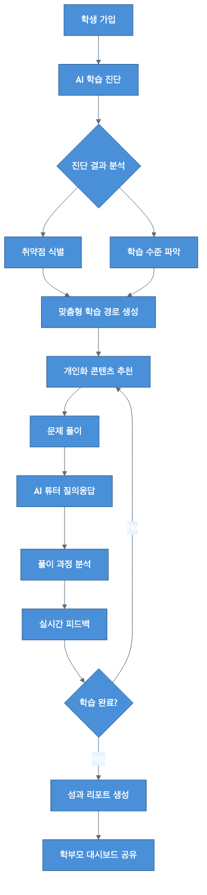

**< TAM/SAM/SOM 시장 규모 >**

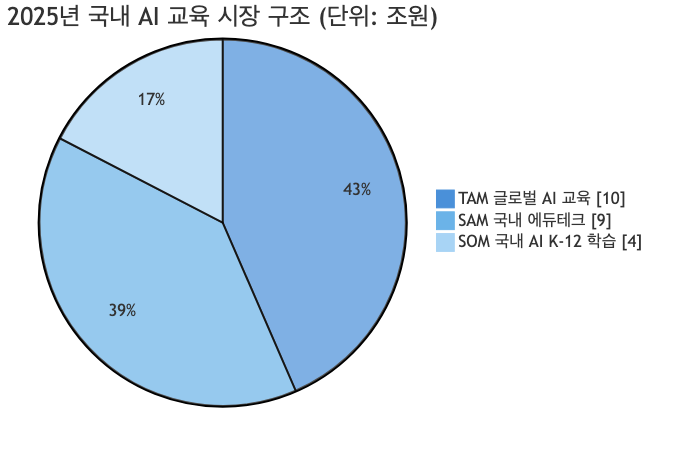

---

## 1. 문제 인식 (Problem) - 창업 아이템의 필요성

### 1-1. 국내 교육 시장의 구조적 문제

우리나라 교육 시장은 심각한 구조적 문제에 직면해 있습니다. 2024년 초중고 사교육비 총액이 **29.2조원**을 돌파하며 역대 최고치를 기록했고, 사교육 참여율은 **80.0%**로 전년 대비 1.5%p 상승했습니다. 학생 1인당 월평균 사교육비는 47.4만원(참여학생 기준 59.2만원)에 달하며, 이는 가계 경제에 상당한 부담을 주고 있습니다.

더 큰 문제는 이러한 막대한 투자에도 불구하고 학습 효율이 낮다는 점입니다. 기존 사교육은 다수의 학생에게 동일한 커리큘럼을 제공하는 **획일화된 교육 방식**을 고수하고 있어, 학생 개개인의 취약점과 학습 스타일을 반영하지 못합니다. 이로 인해 학생들은 이미 아는 내용을 반복 학습하거나, 기초가 부족한 상태에서 어려운 개념으로 넘어가는 비효율적인 학습을 경험하게 됩니다.

### 1-2. 정부 정책의 혼란과 민간 솔루션의 기회

정부는 2023년 AI 디지털교과서(AIDT) 도입을 발표하고 2025년 3월부터 초3-4, 중1, 고1 대상 수학/영어/정보 교과에 시범 적용을 시작했습니다. 그러나 2025년 8월 국회에서 초중등교육법이 개정되어 AIDT의 교과서 지위가 박탈되었고, 이로 인해 **2학기 AIDT 도입률이 60% 급감**(4,095개교에서 1,686개교로)하는 사태가 발생했습니다.

이러한 정책 혼란은 역설적으로 **민간 AI 학습 플랫폼에 기회 요인**으로 작용하고 있습니다. 학교 현장에서의 AI 교육 도입이 불확실해진 상황에서, 학부모들은 자녀의 AI 학습 경험을 위해 민간 솔루션을 적극적으로 탐색하고 있습니다.

### 1-3. 기존 솔루션의 한계와 시장 공백

현재 국내 에듀테크 시장에는 다양한 AI 학습 플랫폼이 존재하지만, 대부분 심각한 한계를 가지고 있습니다:

| 기존 솔루션 유형 | 주요 한계점 |
|---------------|-----------|
| 영어 특화 플랫폼 (뤼이드 등) | 토익/영어에 편중, K-12 전 과목 미지원 |
| 수학 특화 플랫폼 (매쓰플랫 등) | 수학 과목 한정, 타 과목 확장 미흡 |
| 학교 연계 플랫폼 (클래스팅 등) | B2B 중심으로 B2C 접근성 낮음 |
| 프리미엄 코칭 (밀당PT 등) | 높은 가격대, 인력 의존적 모델로 확장성 한계 |

특히 주목할 점은 **GPT-4 수준의 최신 LLM 기반 AI 튜터를 적용한 플랫폼이 거의 부재**하다는 것입니다. 대부분의 기존 플랫폼은 자체 개발 AI 엔진에 의존하고 있어, 자연스러운 대화형 학습 경험과 복잡한 개념 설명 능력에서 한계를 보입니다.

### 1-4. LearnAI의 개발 필요성

이러한 시장 상황에서 LearnAI는 다음과 같은 문제들을 해결하고자 합니다:

**해결하고자 하는 핵심 문제:**
1. **획일화된 교육**: 개인별 학습 수준과 스타일을 무시한 동일 커리큘럼
2. **비효율적 시간 투자**: 이미 알고 있는 내용의 반복, 기초 부족 상태에서의 진도 진행
3. **높은 사교육비 부담**: 효과적인 학습을 위해 과도한 비용 지출 필요
4. **학습 현황 파악 어려움**: 학부모가 자녀의 실질적 학습 상태를 파악하기 어려움
5. **질의응답 접근성**: 궁금증 발생 시 즉각적인 답변을 받기 어려운 환경

**LearnAI의 솔루션 방향:**
- GPT-4 기반 **대화형 AI 튜터**로 24시간 질의응답 지원
- DKT 기반 **정밀 학습 진단**으로 개인별 취약점 자동 식별
- 강화학습 알고리즘을 통한 **최적화된 학습 경로** 자동 생성
- **학부모 대시보드**를 통한 투명한 학습 현황 공유
- 합리적 가격(월 19,900원~)으로 **사교육비 부담 절감**

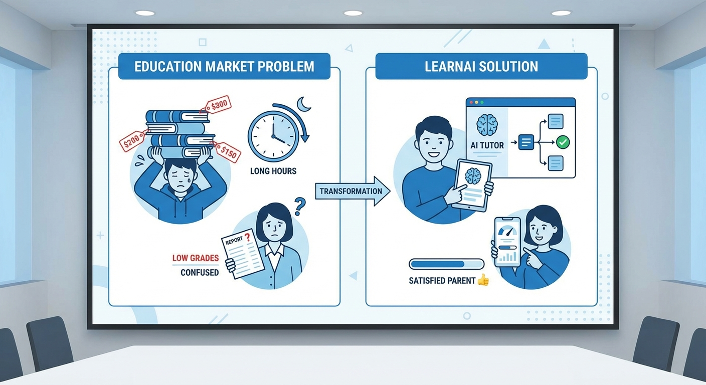

---

## 2. 실현 가능성 (Solution) - 창업 아이템의 개발 계획

### 2-1. 제품/서비스 개발 계획

LearnAI는 협약기간 8개월 내에 다음과 같은 MVP(최소기능제품)를 개발하여 시장에 출시합니다.

**최종 산출물:**
- 모바일 어플리케이션 1개 (iOS/Android 크로스플랫폼)
- 반응형 웹사이트 1개
- AI 학습 엔진 MVP 1개 (중등 수학/영어 과목)

**핵심 기능 개발 범위:**

| 기능 | 상세 내용 | 기술 스택 |
|------|----------|----------|
| AI 학습 진단 | 학생 현재 수준 정밀 진단, 취약 단원/개념 자동 식별 | DKT, PyTorch |
| 맞춤형 학습 경로 | 개인별 최적화 커리큘럼 자동 생성, 실시간 난이도 조절 | 강화학습, LangChain |
| AI 튜터 | 24시간 질의응답, 단계별 힌트 및 풀이 설명 | GPT-4 API, RAG |
| 학습 분석 대시보드 | 학습 패턴/성과 시각화, 학부모/교사용 리포트 | React, D3.js |

### 2-2. 기술적 차별성 및 경쟁력

**핵심 차별화 요소:**

1. **GPT-4 기반 소크라틱 AI 튜터**
   - 단순 답변 제공이 아닌 질문을 통해 학생 스스로 사고하도록 유도
   - 하버드 연구(2025.06)에서 GPT-4 기반 AI 튜터가 학습 이해도를 유의미하게 향상시킨다는 결과 발표
   - Google LearnLM, Microsoft AI Guru 등 글로벌 빅테크도 교육용 LLM 개발에 집중하는 추세

2. **풀이 과정 분석 기반 정밀 진단**
   - 기존 플랫폼: 정답/오답만 판단
   - LearnAI: 풀이 과정을 분석하여 어느 단계에서 오류가 발생했는지 식별
   - 이를 통해 표면적 오답이 아닌 근본적 개념 이해 부족 지점 파악

3. **강화학습 기반 적응형 알고리즘**
   - 학습 시간대, 집중도, 문제 풀이 속도 등 메타 데이터 종합 분석
   - 학생별 최적 학습 패턴을 학습하여 개인화된 학습 스케줄 제안
   - 문제 난이도, 유형, 순서를 실시간으로 조정

4. **전 과목 통합 학습 경로**
   - 수학-영어-과학 등 교차 분석을 통한 종합적 학습 최적화
   - 예: 수학 함수 개념이 약한 학생에게 물리 역학 진도 조정 권고

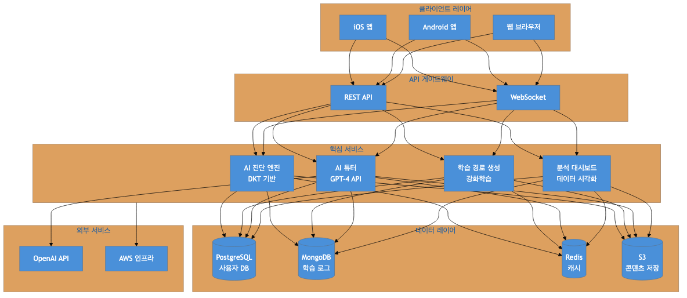

### 2-3. 사업추진 일정 (협약기간 내)

| 구분 | 추진 내용 | 추진 기간 | 세부 내용 |
|------|----------|----------|----------|
| 1 | 핵심 개발 인력 채용 | 25.05 ~ 25.06 | 백엔드 2명, 프론트엔드 1명 채용 |
| 2 | AI 엔진 프로토타입 고도화 | 25.05 ~ 25.07 | DKT 모델 학습, GPT-4 API 연동 |
| 3 | 학습 콘텐츠 확보 | 25.06 ~ 25.08 | 중등 수학/영어 문제 DB 구축 (10,000+ 문항) |
| 4 | 웹/앱 MVP 개발 | 25.07 ~ 25.10 | 크로스플랫폼 앱, 반응형 웹 개발 |
| 5 | 클로즈드 베타 테스트 | 25.10 ~ 25.11 | 100명 대상 베타 테스트 및 피드백 수집 |
| 6 | MVP 출시 및 초기 사용자 확보 | 25.11 ~ 25.12 | 정식 출시 및 1,000명 초기 사용자 목표 |

### 2-4. 정부지원사업비 집행 계획

#### < 1단계 정부지원사업비 집행 계획 >

| 비 목 | 산출 근거 | 정부지원사업비(원) |
|-------|----------|------------------|
| 재료비 | GPU 서버 클라우드 크레딧 (AWS EC2 P4d 인스턴스 3개월) | 5,000,000 |
| 외주용역비 | UI/UX 디자인 외주용역 (앱/웹 디자인 시스템 구축) | 8,000,000 |
| 기계장치 | 개발용 맥북 Pro M3 (1대 x 3,500,000원) | 3,500,000 |
| 지급수수료 | OpenAI API 사용료 (GPT-4 API 3개월) | 2,000,000 |
| 창업활동비 | 사무용품, 문헌 구입 등 | 1,500,000 |
| **합 계** | | **20,000,000** |

#### < 2단계 정부지원사업비 집행 계획 >

| 비 목 | 산출 근거 | 정부지원사업비(원) |
|-------|----------|------------------|
| 인건비 | 백엔드 개발자 1명 급여 (4개월 x 4,500,000원) | 18,000,000 |
| 재료비 | 학습 콘텐츠 데이터 구입 (문제 DB 라이선스) | 5,000,000 |
| 외주용역비 | 앱 개발 외주용역 (Flutter 기반 MVP 개발) | 10,000,000 |
| 특허권 등 무형자산 취득비 | AI 학습 경로 생성 방법 특허 출원 등록비 | 3,000,000 |
| 광고선전비 | 베타 출시 마케팅 (SNS 광고, 인플루언서 협업) | 3,000,000 |
| 지급수수료 | 베타 테스트 참가자 인센티브, 전시회 참가비 | 1,000,000 |
| **합 계** | | **40,000,000** |

---

## 3. 성장전략 (Scale-up) - 사업화 추진 전략

### 3-1. 시장 규모 및 기회 분석

글로벌 AI 교육 시장은 **폭발적인 성장세**를 보이고 있습니다.

**TAM (Total Addressable Market) - 전체 시장:**
- 2025년 글로벌 AI 교육 시장: 약 **70억 달러** (약 10조원)
- 2030년 전망: 약 **320억 달러** (약 45조원)
- CAGR: **31-43%**

**SAM (Serviceable Addressable Market) - 유효 시장:**
- 2024년 국내 에듀테크 시장: 약 **6.5-8.5조원**
- 2030년 전망: 약 **14-16조원**
- CAGR: **7.7-9%**

**SOM (Serviceable Obtainable Market) - 획득 가능 시장:**
- 국내 AI 기반 K-12 적응형 학습 플랫폼 시장: 약 **3-4.5조원**
- LearnAI 목표 시장 (5년 내): 약 **3,000-5,000억원**

### 3-2. 경쟁사 분석 및 포지셔닝

| 경쟁사 | 핵심 서비스 | 강점 | 약점 | LearnAI 차별점 |
|--------|-----------|------|------|---------------|
| 뤼이드 | 산타토익, AI 영어 학습 | 소프트뱅크 2,000억 투자, 누적 487만 사용자 | 토익/영어 편중, K-12 전 과목 미지원 | 전 과목 대응, GPT-4 기반 |
| 클래스팅 AI | K-12 학교 연계 AI 플랫폼 | 전국 4,600개 학교 도입 | B2B 중심, B2C 약세 | B2C 직접 접근, 학부모 친화적 UX |
| 매쓰플랫 | AI 수학 문제은행 | 타임지 세계 최고 에듀테크 18위 | 수학 과목 한정 | 전 과목 통합 학습 경로 |
| 밀당 PT | 1:1 온택트 퍼스널 티칭 | 96% 완강률, 대치동 강사진 | 고가, 인력 의존적 | 완전 AI 기반 가격 경쟁력 |

**LearnAI 포지셔닝:**
- **기술 혁신성**: GPT-4 기반 대화형 AI 튜터 (업계 최초 수준)
- **시장 범위**: K-12 전 과목 통합 (경쟁사 대비 넓은 커버리지)
- **가격 경쟁력**: 월 19,900원부터 (프리미엄 대비 1/3 수준)
- **접근성**: B2C 직접 + B2B 학원/학교 하이브리드 모델

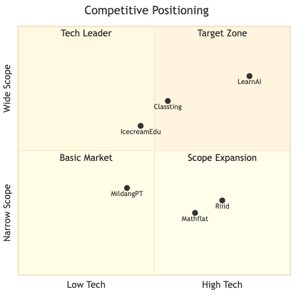

### 3-3. 비즈니스 모델 (수익화 전략)

**B2C 구독 모델 (예상 비중 60%):**

| 플랜 | 월 요금 | 주요 기능 |
|------|--------|----------|
| Basic | 19,900원 | AI 진단 + 기본 학습 경로 + 제한적 AI 튜터 |
| Premium | 39,900원 | 전체 기능 + AI 튜터 무제한 + 성과 리포트 |
| Family | 59,900원 | 최대 3인 가족 플랜 + 학부모 대시보드 |

**B2B 기관 라이선스 (예상 비중 30%):**

| 유형 | 월 요금 | 조건 |
|------|--------|------|
| 학원용 | 학생당 9,900원 | 최소 30명 |
| 학교용 | 학급당 200,000원 | 학급 단위 계약 |

**콘텐츠 제휴 (예상 비중 10%):**
- 교육 출판사 콘텐츠 연동 수수료
- 프리미엄 강의 콘텐츠 판매 수익 배분

### 3-4. 시장 진입 전략

**단계별 시장 진입 로드맵:**

| 단계 | 시기 | 목표 | 전략 |
|------|------|------|------|
| 1단계 | 2025년 | 중등 수학/영어 MVP 출시 | 가장 큰 사교육 수요 집중 공략 |
| 2단계 | 2026년 | 초등/고등 학년 확장 | 기존 사용자 형제/자매 확산 |
| 3단계 | 2027년 | B2B 학원/학교 파트너십 | 기관 라이선스 모델 본격 확대 |
| 4단계 | 2028년~ | 해외 시장 진출 | 일본, 동남아 시장 진출 |

### 3-5. 투자유치 전략

**기 투자 현황:**
- 2024년 6월: 시드 투자 3억원 (패스트벤처스, 기업가치 30억원)

**향후 투자 계획:**
| 라운드 | 목표 시기 | 목표 금액 | 주요 용도 |
|--------|----------|----------|----------|
| Pre-A | 2025년 하반기 | 10억원 | MVP 고도화, 마케팅 |
| Series A | 2026년 상반기 | 50억원 | 전 과목 확장, 팀 확대 |
| Series B | 2027년 | 150억원 | B2B 확대, 해외 진출 |

### 3-6. 사업 전체 로드맵

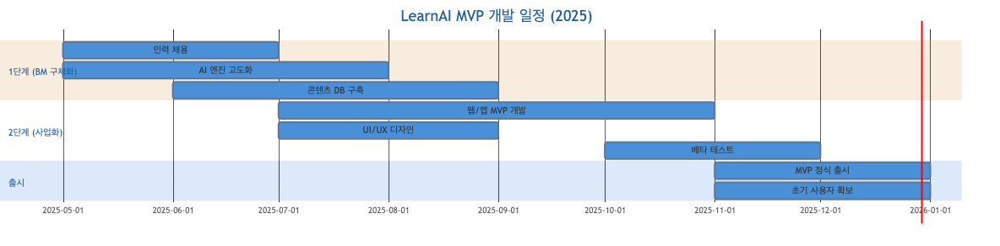

#### < 사업추진 일정(전체 사업단계) >

| 구분 | 추진 내용 | 추진 기간 | 세부 내용 |
|------|----------|----------|----------|
| 1 | MVP 개발 완료 | 2025년 상반기 | 중등 수학/영어 MVP 출시 |
| 2 | 초기 사용자 확보 | 2025년 하반기 | MAU 5만명 목표 달성 |
| 3 | 전 과목 확장 | 2026년 | 초등/고등 및 과학/사회 과목 추가 |
| 4 | B2B 서비스 런칭 | 2026년 하반기 | 학원용 서비스 정식 출시 |
| 5 | MAU 30만명 달성 | 2027년 | 시장 점유율 5% 목표 |
| 6 | 해외 진출 | 2028년 | 일본, 동남아 시장 진출 |

### 3-7. 목표 KPI

| 지표 | 1년차 (2025) | 3년차 (2027) | 5년차 (2029) |
|------|-------------|-------------|-------------|
| MAU | 5만명 | 30만명 | 100만명 |
| 매출 | 30억원 | 200억원 | 1,000억원 |
| 시장점유율 | 1% | 5% | 15% |

### 3-8. 중장기 사회적 가치 도입계획

**환경 (Environmental):**
- 온라인 학습을 통한 사교육 이동 감소로 탄소 배출 절감
- 종이 교재 대신 디지털 콘텐츠 활용으로 자원 절약
- 친환경 클라우드 인프라(AWS RE 100) 활용

**사회 (Social):**
- 교육 격차 해소: 저소득층 학생 대상 무료/할인 프로그램 운영
- 지역 교육 기회 확대: 지방 학생도 동등한 AI 튜터 접근
- 장애 학생 접근성: 음성 지원, 자막 기능 등 유니버설 디자인 적용

**지배구조 (Governance):**
- 학습 데이터 프라이버시 보호 강화 (GDPR 수준 정책 적용)
- 윤리적 AI 개발: 편향 없는 AI 튜터 학습 데이터 관리
- 투명 경영: 정기적인 사회적 가치 보고서 발간

---

## 4. 팀 구성 (Team) - 대표자 및 팀원 구성 계획

### 4-1. 대표자 보유 역량

**학력:**
- 컴퓨터공학과 학사
- 경영대학원 MBA 과정 수료

**경력:**
- AI 연구원 경력 3년: 자연어처리 연구 및 개발
- 대기업 선임연구원 경력 3년: AI 기반 서비스 기획
- 에듀테크 스타트업 COO 경력 3년: 사업 전략 및 운영 총괄
- 현재 LearnAI CEO: 창업 및 경영 총괄

**핵심 역량:**
1. **기술 이해력**: AI/ML 연구 경험을 바탕으로 기술팀과 원활한 커뮤니케이션 가능
2. **사업 운영 경험**: 에듀테크 스타트업 COO로서 0→1 사업 구축 경험 보유
3. **경영 역량**: MBA 과정을 통해 재무, 마케팅, 전략 수립 역량 강화
4. **네트워크**: 에듀테크 업계 및 투자사 네트워크 보유

**정부 지원사업 수행 이력:**
- 2024년 예비창업패키지 최종 선정 (창업진흥원)
- 서울창업허브 입주기업 선정 (서울산업진흥원)
- 에듀테크 스타트업 경진대회 우수상 (교육부)

### 4-2. 팀원 보유 역량

| 구분 | 직위 | 담당 업무 | 보유 역량(경력 및 학력 등) | 구성 상태 |
|------|------|----------|--------------------------|----------|
| 1 | CTO | AI 엔진 개발 총괄 | 전산학 박사, 글로벌 빅테크 ML엔지니어 5년, 국내 AI 스타트업 3년 | 완료('24.05) |
| 2 | CPO | 제품 기획, UX/UI 설계 | 인지과학 석사, 핀테크 Product Designer 4년, 에듀테크 PM 3년 | 완료('24.05) |
| 3 | CMO | 마케팅 전략, 고객 획득 | 경영학 학사, 대형 교육기업 마케팅 5년, 에듀테크 그로스팀 3년 | 완료('24.05) |
| 4 | 백엔드 개발자 | 서버/DB 개발 | 컴퓨터공학 학사, 개발 경력 3년 이상 | 예정('25.05) |
| 5 | 백엔드 개발자 | API/인프라 | 컴퓨터공학 학사, 개발 경력 3년 이상 | 예정('25.05) |
| 6 | 프론트엔드 개발자 | 앱/웹 개발 | 소프트웨어공학 학사, 개발 경력 2년 이상 | 예정('25.06) |

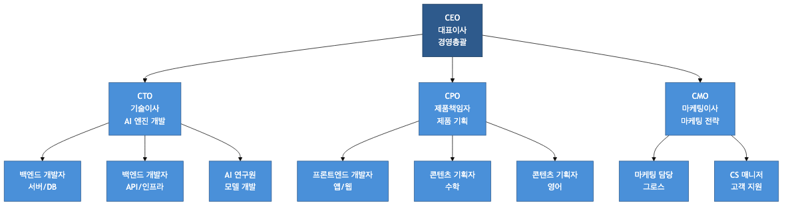

### 4-3. 채용 계획

| 시기 | 직무 | 인원 | 요건 |
|------|------|------|------|
| 2025년 상반기 | 백엔드 개발자 | 2명 | Python/Node.js 경력 3년 이상 |
| 2025년 상반기 | 프론트엔드 개발자 | 1명 | React/Flutter 경력 2년 이상 |
| 2025년 하반기 | AI 연구원 | 1명 | NLP/ML 석사 이상 |
| 2025년 하반기 | 콘텐츠 기획자 | 2명 | 교육 콘텐츠 기획 경력 2년 이상 |
| 2026년 | 영업/파트너십 | 2명 | B2B 영업 경력 3년 이상 |
| 2026년 | CS 매니저 | 1명 | 고객 서비스 경력 2년 이상 |

### 4-4. 협력 기관 현황 및 협업 방안

| 구분 | 파트너명 | 보유 역량 | 협업 방안 | 협력 시기 |
|------|---------|----------|----------|----------|
| 1 | 비상교육 | 교과서 기반 문제 콘텐츠 | 콘텐츠 제휴 협의 중 | 25.06 |
| 2 | OpenAI | GPT-4 API | API 파트너 프로그램 | 완료 |
| 3 | AWS | 클라우드 인프라 | 스타트업 지원 프로그램 (크레딧 $10,000) | 완료 |
| 4 | 서울시교육청 | 학교 시범사업 운영 | 시범학교 운영 논의 중 | 25.09 |
| 5 | 청담어학원 | 학원 B2B 테스트 | B2B 파일럿 테스트 예정 | 25.10 |

### 4-5. 보유 장비/시설 현황

| 구분 | 항목 | 용도 | 상태 |
|------|------|------|------|
| 1 | AWS 클라우드 서버 | AI 엔진 학습 및 서비스 운영 | 운영 중 |
| 2 | GPU 서버 (A100 x 2) | 딥러닝 모델 학습 | 임차 중 |
| 3 | 맥북 Pro M2 (3대) | 개발 및 디자인 작업 | 보유 |
| 4 | 사무 공간 | 서울창업허브 입주 | 확보 |

---

## Mermaid 다이어그램

### 다이어그램 1: 서비스 플로우

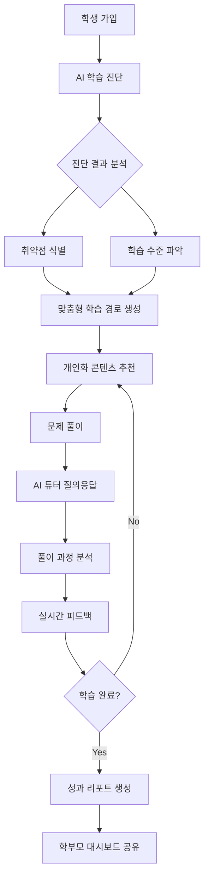

### 다이어그램 2: 시장 규모 (TAM/SAM/SOM)

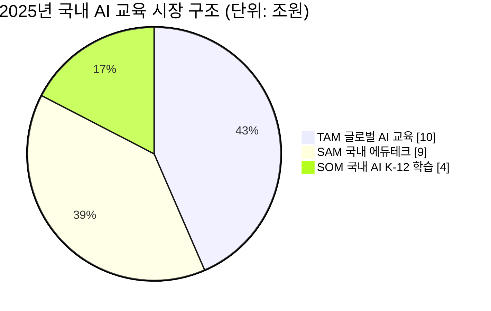

### 다이어그램 3: 개발 일정 (Gantt)

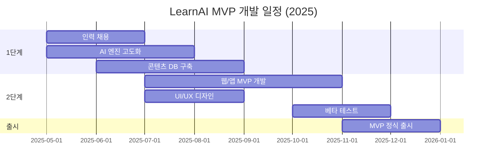

### 다이어그램 4: 경쟁 포지셔닝 (Quadrant Chart)

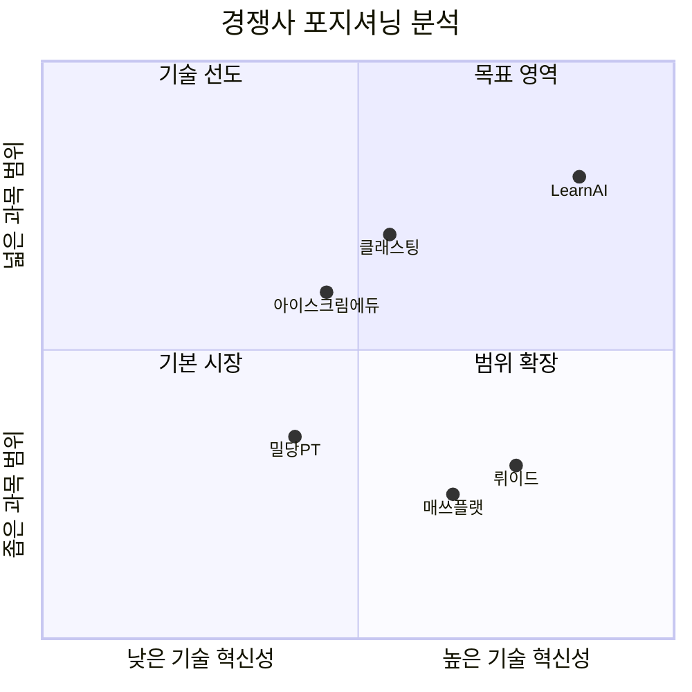

### 다이어그램 5: 조직 구조

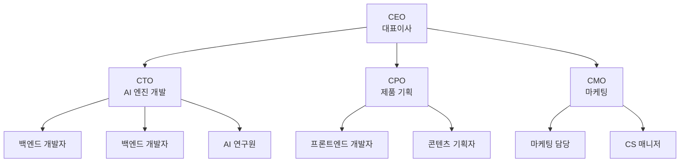

---

## 이미지 생성 가이드라인

### 이미지 1: 시장 문제와 솔루션 인포그래픽

**파일명**: `./images/01_시장문제와솔루션.png`

**프롬프트**:
Professional infographic showing the education market problem and LearnAI solution. Left side shows problems: a stressed student surrounded by expensive textbooks with price tags, a clock showing long study hours, and a confused parent looking at grades. Right side shows solutions: a happy student with a tablet showing AI tutor interface, personalized learning path visualization, and a satisfied parent viewing dashboard on phone. Use clean blue and white color scheme. Include Korean text labels: '문제점' on left, '솔루션' on right. Corporate presentation style, minimalist design, flat illustration style.

### 이미지 2: 비즈니스 모델 다이어그램

**파일명**: `./images/02_비즈니스모델.png`

**프롬프트**:
Clean business model canvas infographic for AI education platform. Show three revenue streams: B2C subscription model with student icons paying monthly fees, B2B institutional licensing with school and academy buildings, and content partnership with publisher logos. Include pricing tiers: Basic 19,900원, Premium 39,900원, Family 59,900원. Use professional blue gradient color scheme. Include arrows showing money flow from customers to LearnAI platform in center. Modern startup pitch deck style, Korean won currency symbols visible.

---

## 증빙서류 목록

- [x] 사업자등록증 사본
- [x] 법인등기부등본
- [x] 대표자 이력서
- [x] 팀원 이력서
- [x] 특허 출원 확인서 (2건)
- [x] 투자계약서 사본 (시드 3억원)
- [x] AWS 스타트업 프로그램 확인서
- [x] OpenAI API 파트너 확인서
- [ ] 콘텐츠 제휴 MOU (협의 중)
- [ ] 학교 시범사업 MOU (협의 중)

---

**문서 작성일**: 2025년 2월
**작성자**: 대표자 (CEO)
**지원 주관기관**: 서울과학기술대학교
